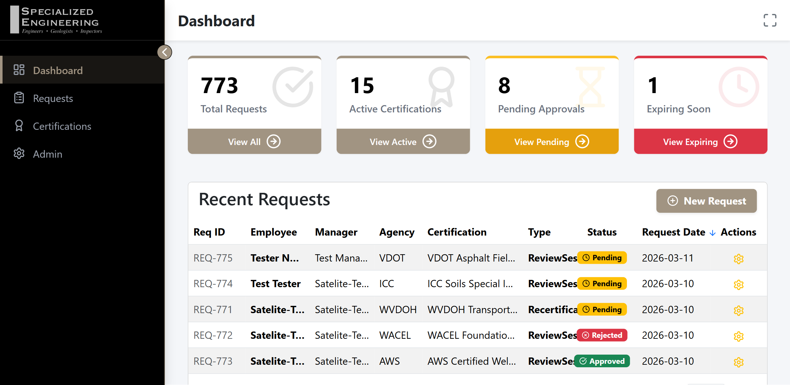
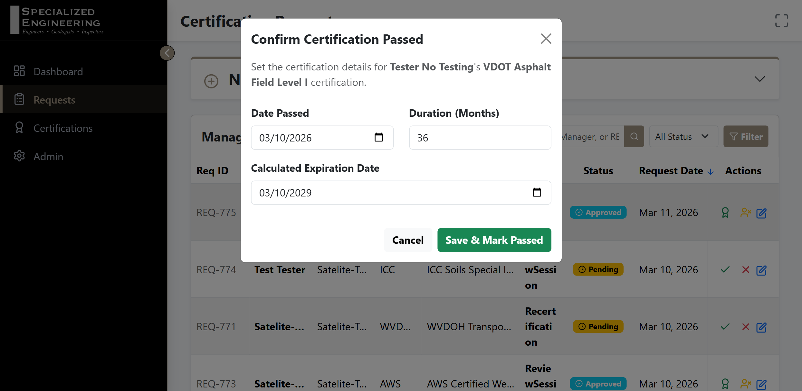
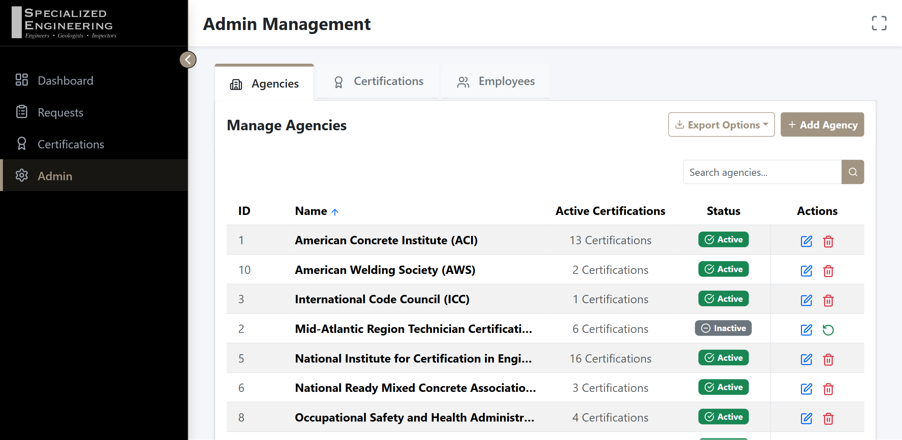
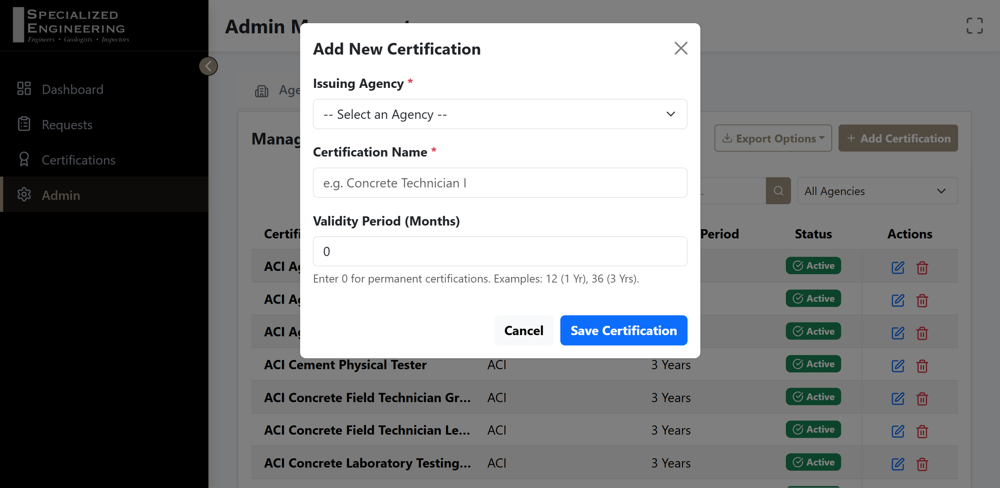
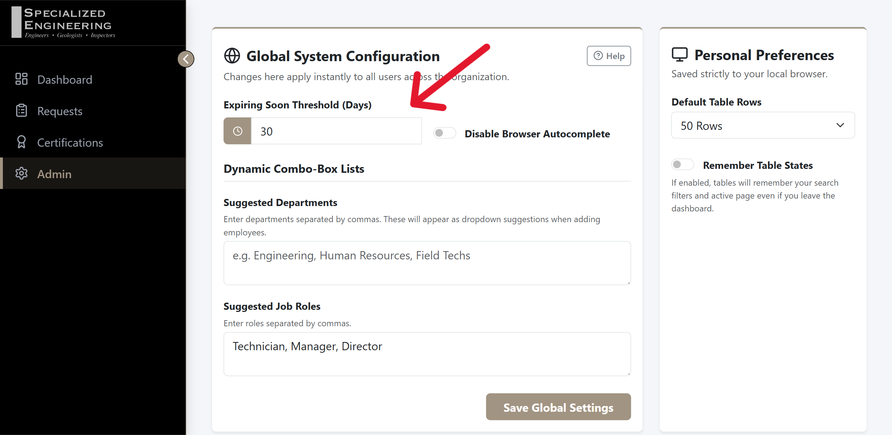

# Specialized Engineering - HR Certification Portal User Guide

Welcome to the definitive user manual for the Specialized Engineering HR Certification Portal. This guide provides step-by-step instructions for utilizing every major functional area of the application.

---

## 🛠️ Phase 1: Infrastructure & Portal Access

**Accessing the Portal**
The HR Certification Portal is deployed as an internal IIS web application designed for desktop use.
- **Production URL:** `http://[Internal-Server-IP]:8080` (Please check with your IT administrator for the specific server hostname or IP address).
- **Authentication:** This is an internal tool on the company intranet. It does not require a traditional username/password login screen; instead, access is restricted to the internal network.

**Browser Compatibility**
The User Interface is optimized for desktop and laptop displays (Google Chrome, Microsoft Edge). *Please note that the portal is not optimized for use on mobile devices or tablets.*

---

## 📊 Phase 2: The Executive Dashboard

The Executive Dashboard provides high-level KPI monitoring and visibility into the workforce's health regarding certifications.

**KPI Cards Explained**
- **Total Requests:** The aggregate count of all historical certification entries submitted.
- **Active Certifications:** Only records marked as "Passed" that currently have a valid, future expiration date.
- **Pending Approvals:** Records that have been submitted and are awaiting HR review.
- **Expiring Soon:** The count of active certifications that will expire within the configured threshold (default is 30 days).

**Critical Action Items Table**
Below the KPIs, the **Recent Requests** table highlights the latest activities. This table allows you to quickly spot requests requiring immediate attention (e.g., Pending Approvals). You can sort this table by clicking the column headers.

---

## 📝 Phase 3: Request Lifecycle Management

This section covers managing a certification request's transition from "Requested" to "Passed Certification."

**1. Creating a New Request (Validation & Cascading Logic)**
- Navigate to the **Requests** page.
- Click **New Request** to expand the form. 
- *Dual-Layer Validation:* The system ensures all required fields are filled. Attempting to submit an empty form will trigger a validation error notification.
- *Cascading Options:* Select an Agency from the "Certification Agency" dropdown. The "Certification Desired" dropdown will immediately update to only show certifications offered by that specific agency.

**2. Request Actions & Workflows**
- **Approving:** Find a request in the "Pending" state and click the checkmark icon (`Approve Request`) to change it to "Approved."
- **Marking Passed:** Once a request is Approved, a ribbon icon (`Mark as Passed`) becomes available. Clicking it opens the "Mark Passed" modal. 
  - *Auto-Calculation:* Simply enter the Date Passed. The system references the certification's configured "Validity Period" and automatically calculates the exact "Calculated Expiration Date."
- **Editing:** You can update manager names, request types, or correct typos by clicking the blue pencil icon (`Edit Request`) on any record.

**3. Data Export**
- Use the **Export CSV** button in the top right corner of the Requests card to generate a spreadsheet artifact matching your currently filtered view.

---

## 📚 Phase 4: Relational Dictionary (Agencies & Certs)

The Relational Dictionary maintains the data engine that drives the dropdown lists throughout the application.

**1. Agency Management**
- Navigate to the **Admin Management** section and select the **Agencies** tab.
- Here you can manage the list of governing bodies (e.g., ACI, MARTCP). 
- To add a new regulating authority, click **Add Agency** and provide the abbreviation and full name.

**2. Certification Mapping**
- Switch to the **Certifications** tab.
- Click **Add Certification**.
- Link the specific certification to its issuing Agency and set its standard validity period in months (e.g., 36 months for a 3-year cert). Enter `0` for permanent/lifetime certifications.

---

## ⚙️ Phase 5: System Administration

The System Administration view manages global configuration options and system troubleshooting.

**1. Threshold Settings**
- Navigate to **Admin Management** and look under **Global System Configuration**.
- You can change the "Expiring Soon Threshold (Days)" (default is 30 days). Updating this instantly adjusts which certifications are flagged on the dashboard and email alerts.

**2. Employee Registry**
- Switch to the **Employees** tab in Admin Management.
- Manage the silent auto-generation of employees here. If duplicate or inactive employees appear from Active Directory imports, use the Deactivate (trash bin) tool to perform manual cleanup and hide them from selection menus.

