# Specialized Engineering - HR Certification Portal User Guide

Welcome to the user manual for the Specialized Engineering HR Certification & Request Portal. This guide provides step-by-step instructions for utilizing every major functional area of the application.

---

## 🛠️ Phase 1: Infrastructure & Portal Access

**Accessing the Portal**
The HR Certification Portal is deployed as an internal IIS web application designed for desktop or Laptop use.
- **Production URL:** Access using `http://hr-portal.specializedengineering.com:8080/` or using the direct desktop shortcut.
- **Authentication:** This is an internal tool on the company intranet. It does not require a traditional username/password login screen; instead, access is restricted to the internal network.

*Note: Please check with your IT administrator or System Administrator to have the shortcut added to the Administrtor computers.*

**Browser Compatibility**
The User Interface is optimized for desktop and laptop displays with cross browser compatibility (Google Chrome, Microsoft Edge, Safari, Firefox, etc.). 

*Please note that the portal is not optimized for use on mobile devices but most tablets should work with the left hand sidebar collapsed.*

---

## 📊 Phase 2: The Executive Dashboard

The Executive Dashboard provides high-level KPI monitoring and visibility into the workforce's health regarding certifications.

**KPI Cards Explained**
- **Total Requests:** The aggregate count of all historical certification request entries submitted.
- **Active Certifications:** Only records marked as "Passed" that currently have a valid, future expiration date.
- **Pending Approvals:** Records that have been submitted and are awaiting HR review.
- **Expiring Soon:** The count of active certifications that will expire within the configured threshold (default is 30 days).

**Critical Action Items Table**
Below the KPIs, the **Recent Requests** table highlights the latest activities. This table allows you to quickly spot requests requiring immediate attention (e.g., Pending Approvals). You can sort this table by clicking the column headers.

---

## 📝 Phase 3: Request Lifecycle Management

This section covers managing a certification request's transition from "Requested" to "Passed Certification."

**1. Creating a New Request (Validation & Cascading Logic)**
- Navigate to the **Requests** page.
- Click **New Request** to expand the form. 
- *Dual-Layer Validation:* The system ensures all required fields are filled. Attempting to submit an empty form will trigger a validation error notification.
- *Cascading Options:* Select an Agency from the "Certification Agency" dropdown. The "Certification Desired" dropdown will immediately update to only show certifications offered by that specific agency.

💡 Pro-Tip: While HR can manually add requests here, most entries are designed to flow into this table automatically from the Employee Submission Portal used by Employees (See Phase 9).

**2. Request Actions & Workflows**
- **Approving:** Find a request in the "Pending" state and click the checkmark icon (`Approve Request`) to change it to "Approved."
- **Marking Passed:** Once a request is Approved, a ribbon icon (`Mark as Passed`) becomes available. Clicking it opens the "Mark Passed" modal. 
  - *Auto-Calculation:* Simply enter the Date Passed. The system references the certification's configured "Validity Period" and automatically calculates the exact "Calculated Expiration Date."
- **Editing:** You can update manager names, request types, or correct typos by clicking the blue pencil icon (`Edit Request`) on any record.

**3. Data Search & Filtering**
- **Search Bar:** Located in the top right of the Requests table. You can search by **Employee Name**, **Manager Name**, or the exact **REQ ID**.
- **Status Filter:** Use the dropdown next to the search bar to filter requests by their current lifecycle state (Pending, Approved, Passed, Failed, Rejected).
- **Clearing Filters:** Once a search or filter is applied, an `X` icon will appear next to the filter button. Click it to clear all active filters and return to the default view.

**4. Data Export**
- **Exporting to CSV:** Use the **Export CSV** button in the top right corner of the Requests card to generate a spreadsheet artifact matching your currently filtered view. This is useful for data analysis in Excel.

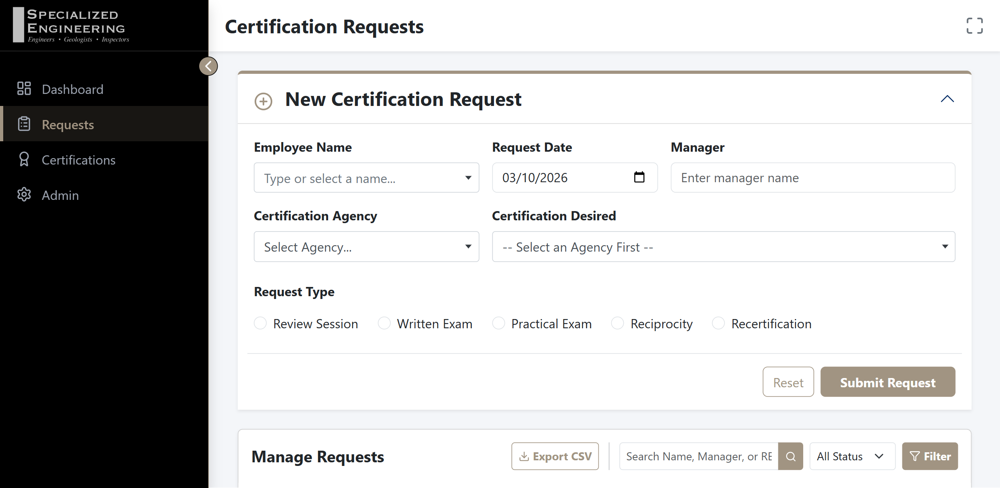

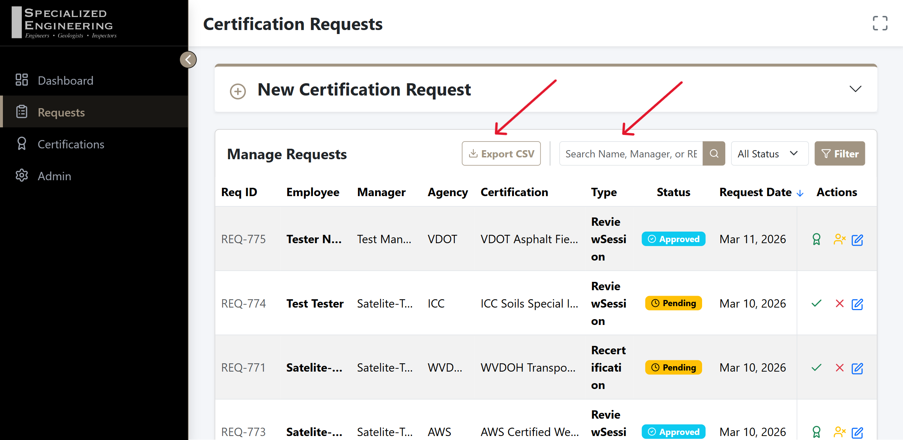

---

## 📋 Phase 4: Employee Certifications Tracker

The Employee Certifications Tracker is the compliance command center of the portal. It surfaces every active, revoked, and historical certification record in one searchable, sortable table — and pairs it with a live analytics dashboard that quantifies workforce coverage at a glance.

**1. Compliance Analytics Dashboard**

At the top of the Certifications page you will find three KPI cards that give an immediate pulse on the organization's compliance posture:

| Card | Color | What It Counts |
|------|-------|----------------|
| **Total Active** | Green | All certifications that are currently valid and not expiring within the configured threshold window (plus all Permanent certifications). |
| **Expiring Soon** | Orange | Active certifications whose expiration date falls within the "Expiring Soon" threshold (default 30 days; configurable in Global System Configuration). |
| **Critical Lapses** | Red | Certifications whose expiration date has already passed — records requiring immediate remediation or re-testing. |

Below the KPI cards, two distribution charts display the **Top 5 Agencies** and **Top 5 Certifications** held across the workforce. These charts are rendered dynamically from live database data on every page load.

📐 Added Detail: Collapsible Interface
The Compliance & Coverage Analytics dashboard is designed to be flexible. If you need to maximize screen space for the certifications table, you can hide the visual charts:

Collapsing the Panel: Click the section header titled "Compliance & Coverage Analytics". A chevron icon next to the title will rotate, and the entire chart area will slide up and disappear.

Focusing on Data: This allows you to focus strictly on the Employee Certifications table while keeping the dashboard metrics just one click away.

Persistent State: The application remembers whether you left the analytics panel open or closed, ensuring your preferred view is maintained as you navigate between different pages.

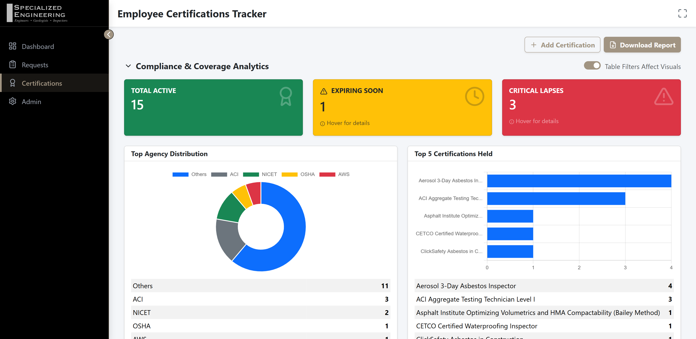

**2. Analytics Toggle: "Table Filters Affect Visuals"**

A toggle switch labeled **Table Filters Affect Visuals** appears in the analytics panel header. This is one of the most powerful features of the tracker:

- **Switch ON (default):** The KPI card counts and the two distribution charts respond in real time to whatever search term, Agency filter, or Status filter is currently active on the table below. If you filter the table to show only "ACI" certifications, for example, the charts will only reflect ACI coverage data.
- **Switch OFF:** The KPI cards and charts always display global, unfiltered workforce analytics, regardless of how the table below is narrowed. Use this mode when you need to cross-reference a specific subset in the table while keeping the full-picture metrics visible in the header.

Toggling this switch re-submits the page with the updated filter parameter — no manual refresh is required.

💡 Pro-Tip: Use the toggle in the OFF position when you are investigating one employee's record but still need to see the organization-wide "Expiring Soon" count in the header for situational awareness.

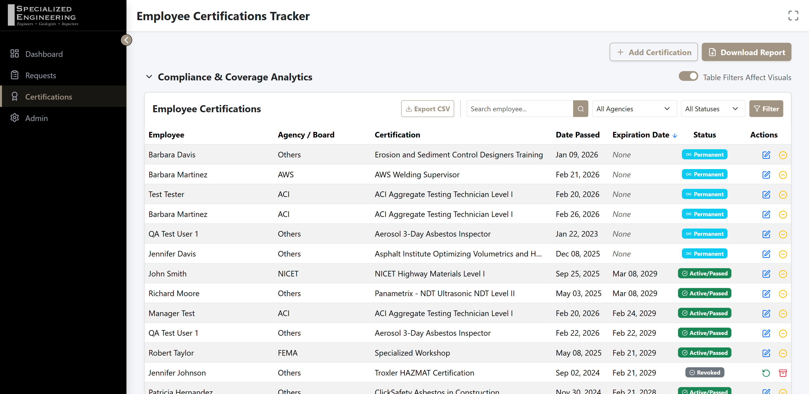

**3. Direct Entry: Adding a Historical Certification**

For certifications that were completed outside of the standard request workflow (e.g., legacy records, certifications obtained before the portal was implemented), HR Administrators can record them directly without creating a request first.

- Click the **Add Certification** button in the top-right corner of the Certifications card.
- The **Add Certification** modal will open. Complete the following fields:
  - **Employee** — Select the employee from the dropdown, or type a new name if the employee does not yet exist in the registry. The system will automatically create a new employee profile on save.
  - **Agency** — Select the issuing agency.
  - **Certification** — Select the specific certification from the list.
  - **Date Passed** — The date the employee successfully obtained the certification.
  - **Expiration Date** — The date the certification expires. Leave this blank for permanent/lifetime certifications.
- Click **Save**. The record is immediately created with a `Passed` status and appears in the tracker table.

> **Note:** Direct-entry records bypass the standard Pending → Approved → Passed approval lifecycle. They are intended for historical data entry and administrative corrections only.

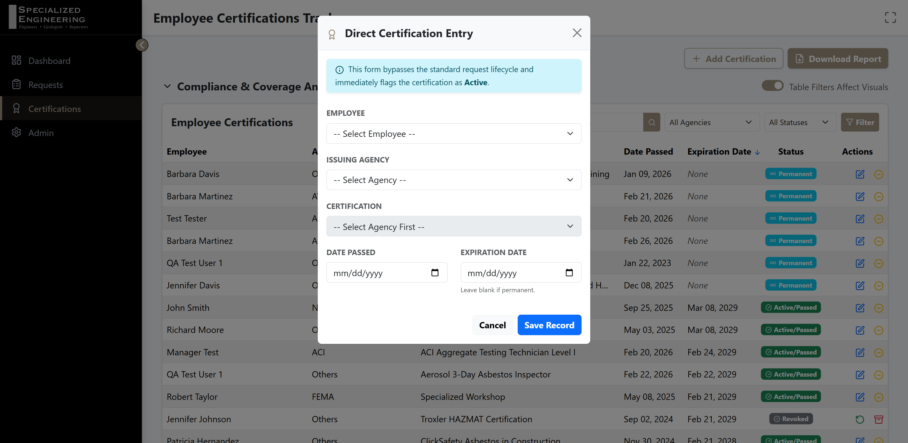

**4. Row-Level Management Actions**

Each record in the Certifications table has an **Actions** menu providing the following operations:

| Action | Icon | Effect | When to Use |
|--------|------|--------|-------------|
| **Edit** | Blue pencil | Opens an edit modal to correct the **Date Passed** and/or the **Expiration Date** for the record. | Use to fix an incorrectly entered date without altering the certification's status. |
| **Revoke** | Red ban icon | Changes the record's status from `Passed` → `Revoked`, deactivating it. | Use when a certification is suspended, rescinded by the issuing agency, or the employee is no longer in good standing. |
| **Restore** | Green checkmark | Changes the record's status from `Revoked` → `Passed`, re-activating it. | Use when a previously revoked certification has been reinstated. |
| **Archive** | Grey box icon | Changes the record's status to `Archived`, moving it to historical preservation. | Use for certifications that have permanently expired and will not be renewed, keeping them visible for audit trails without cluttering active views. |

> **Note:** Revoked records remain visible in the tracker table and are included in analytics so HR retains a complete audit trail. Use the **Status Filter** to isolate Revoked or Archived records when needed.

**5. Reporting: Download Report & Export CSV**

Two export options are available: Download Report in the top-right corner of the Certifications card and the Export CSV button in header of the Employee Certifications table:

- **Download Report (PDF):**
  Generates a formatted, print-ready PDF named `SPE_Analytics_Report_[date].pdf`. The report includes:
  - The three KPI summary cards (Total Active, Expiring Soon, Critical Lapses) with counts matching the current analytics state.
  - The Agency Distribution and Certification Distribution charts embedded as images from the live dashboard.
  - A full **Coverage Breakdown** table of all records matching the current filter, grouped by Certification name and sorted by employee name.
  The PDF report respects the **Table Filters Affect Visuals** toggle state, so the KPI counts printed in the header will match what was visible on screen when the report was generated.

- **Export CSV:**
  Generates a `Employee_Certifications_Export_[date].csv` spreadsheet containing all records matching the current table filters. Each row includes: Employee, Agency, Certification, Date Passed, Expiration Date, and computed Status. This file is optimized for analysis in Excel or any spreadsheet tool.

💡 Pro-Tip: Apply your desired filters first, then generate the PDF or CSV — both exports capture exactly the filtered view you see on screen, making it easy to produce agency-specific or status-specific compliance reports.

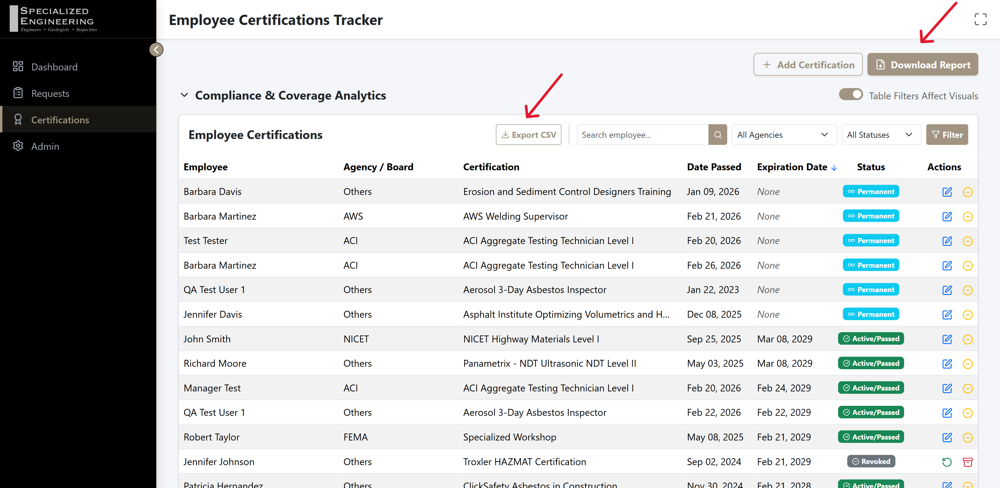
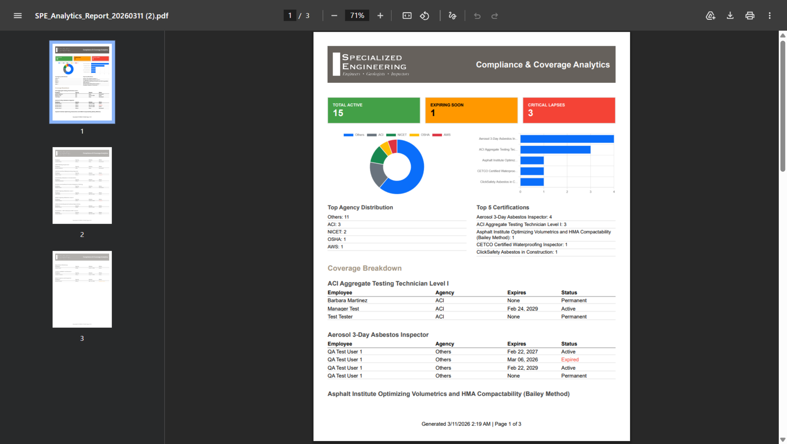

---

## 🗂️ Global Feature: Table Sorting & Navigation

Across all major data tables in the portal (Dashboard, Requests, Certifications, Admin Grid), you have powerful sorting and navigation controls:

**Column Sorting Logic**
Most column headers are clickable and feature a three-state sorting cycle:
1. **First Click:** Sorts the data **Ascending** (A-Z, or oldest to newest). An up-arrow icon will appear.
2. **Second Click:** Sorts the data **Descending** (Z-A, or newest to oldest). A down-arrow icon will appear.
3. **Third Click (Reset):** Clears the custom sort and returns the table to its **Default Sort State** (e.g., restoring the default "Request Date - Descending" view). The sort icon will revert to the default unsorted state.

**Pagination & Page Sizing**
At the bottom of every major table, you will find navigation controls:
- Use the **"Show [ X ] entries"** dropdown to change how many records are displayed per page (e.g., 10, 25, 50, 100).
- Use the pagination numbers to jump between pages of results.
- *Note: If you enable "Remember Table States" in your personal System Settings, the application will remember your page size and current page number even if you navigate away.*

---

## 📚 Phase 5: Relational Dictionary (Agencies & Certs)

The Relational Dictionary maintains the data engine that drives the dropdown lists throughout the application.

**1. Agency Management**
- Navigate to the **Admin Management** section and select the **Agencies** tab.
- Here you can manage the list of governing bodies (e.g., ACI, MARTCP). 
- To add a new regulating authority, click **Add Agency** and provide the abbreviation and full name.
- **Search:** Use the inline search bar to quickly find an agency by name or abbreviation.
- **Export:** Click "Export Options" to download the Agency list as a raw **CSV** or as a formatted **PDF Catalog**.

**2. Certification Mapping**
- Switch to the **Certifications** tab.
- Click **Add Certification**.
- Link the specific certification to its issuing Agency and set its standard validity period in months (e.g., 36 months for a 3-year cert). Enter `0` for permanent/lifetime certifications.
- **Search & Filter:** You can search certifications by name, or use the dropdown to filter the table to only show certifications from a specific Agency.
- **Export:** Click "Export Options" to download the Certification list as a **CSV** or export a full structured **PDF Catalog**.

---

## ⚙️ Phase 6: System Administration

The System Administration view manages global configuration options, employee records, and administrative corrections. Administrators can reverse actions and configure dynamic dropdown lists directly from this view.

**1. Threshold Settings**
- Navigate to **Admin Management** and look under **Global System Configuration**.
- You can change the "Expiring Soon Threshold (Days)" (default is 30 days). Updating this instantly adjusts which certifications are flagged on the dashboard and email alerts.

**2. Employee Registry & Document Generation**
- Switch to the **Employees** tab in Admin Management.
- Manage the silent auto-generation of employees here. If duplicate or inactive employees appear from Active Directory imports, use the Deactivate (trash bin) tool to perform manual cleanup and hide them from selection menus.
- **Search:** Quickly search for a specific employee by their display name.
- **Print History (PDF):** Click the printer icon next to any employee to generate a beautiful, formatted **PDF Document** of their entire certification history.
- **Bulk Export:** Use the "Export Options" dropdown to export the entire employee registry as a **CSV** spreadsheet or a comprehensive **PDF Report**.

---

## 🔄 Phase 7: Administrative Action Reversal

Mistakes happen. The portal supports full administrative correction of any certification request's status and expiration date without requiring a new submission.

**When to Use This Feature**
- A request was accidentally marked **Rejected** but should be **Pending** again.
- A cert was marked **Passed** with an incorrect expiration date that needs to be corrected.
- A **Passed** cert needs to be reverted to **Approved** for re-review.

**How to Correct a Request**
1. Navigate to the **Requests** page.
2. Locate the request you need to correct (use Search or Status Filter to find it quickly).
3. Click the **blue pencil icon** (Edit) in the Actions column for that record.
4. The **Edit Request** modal will open. In addition to the standard fields, you will now see:
   - **Status** — A dropdown containing all possible states: `Pending`, `Approved`, `Rejected`, `Passed`, `Failed`, `Revoked`, `Archived`. Select the correct state.
   - **Expiration Date** — A date picker pre-filled with the current expiration date (blank if the cert is Permanent). Clear or change this date as needed.
5. Click **Save Changes**. The record will immediately reflect the corrected status and date in the table.

> **Note:** Changing a status back to `Passed` does not automatically recalculate the expiration date. You must set the correct expiration date manually in the same edit operation.

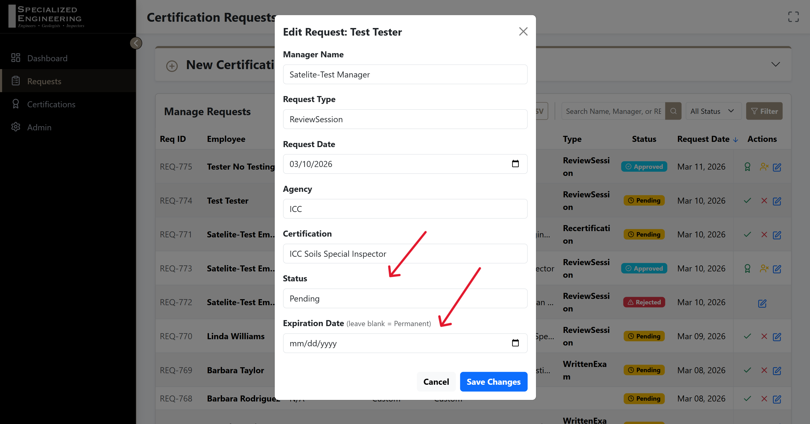

---

## 🌐 Phase 8: Global System Configuration

The **Global System Configuration** panel, located below the Admin Management tabs, controls system-wide settings that apply to all users instantly.

**Expiring Soon Threshold**
Sets the number of days before a certification expiry that it is flagged as "Expiring Soon" on the dashboard and in analytics reports.

**Dynamic Combo-Box Lists**
The portal supports live-updating suggestion lists for the **Department** and **Job Role** fields when adding or editing employees. These lists are managed centrally and require no developer involvement to update.

- **Suggested Departments** — Enter department names separated by commas (e.g., `Engineering, Field Operations, Human Resources`). These appear as autocomplete suggestions in the Department field throughout the application.
- **Suggested Job Roles** — Enter role titles separated by commas (e.g., `Technician, Inspector, Manager`). These appear as autocomplete suggestions in the Role field.

**Disable Browser Autocomplete**
Toggle this switch to suppress native browser autofill across all form inputs in the portal — useful in shared workstation environments.

**Saving Settings**
Click **Save Global Settings** after making any changes. A green confirmation banner will appear at the top of the page confirming the save was successful.

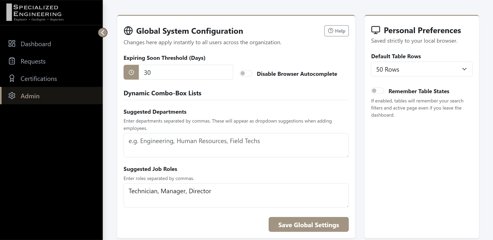

---

## ❓ Phase 9: Integrated Help

A **Help** button is now available directly in the portal UI so you never need to leave the application to find guidance.

**Location**
- Navigate to **Admin Management** and scroll down to the **Global System Configuration** card.
- In the top-right corner of the card header, you will see a small **Help** button with a `help-circle` icon.

**How It Works**
- Clicking the **Help** button opens this User Guide (as a PDF) **in a new browser tab**.
- The guide is served directly from the application server — no internet connection is required.
- The PDF is always the latest version approved for the current release.

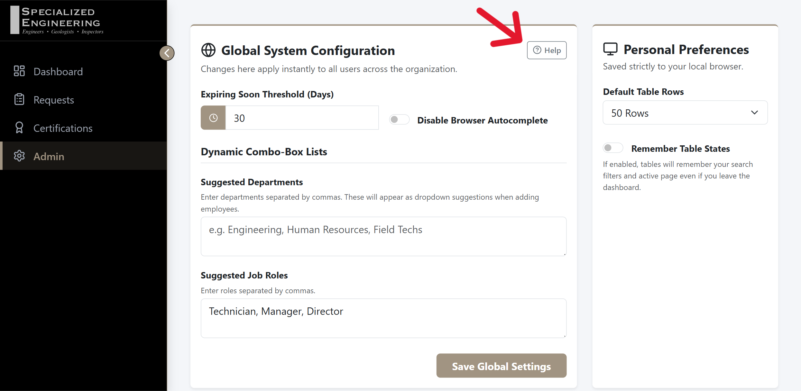

---

---

## 🛰️ Phase 10: The Employee Submission Portal

For field staff and non-administrative personnel, a streamlined **Employee Submission Portal** is available to ensure certification requests can be logged from any company workstation without granting access to the full HR Dashboard.

**How to Access**
- **URL:** `http://10.1.0.47:8081/` (Temporary access via IP address until a dedicated hostname is provided)
- **Purpose:** A single-page form designed for quick entry from any company workstation or tablet.

*Note: Please check with your IT administrator or System Administrator to have the shortcut added to the Employee computers.*

**Key Features**
- **Auto-Registry:** If an employee enters a name that does not exist in the HR database, the system will automatically create a new employee profile upon submission.
- **Validation:** The form requires the Manager's Name, Employee Name, Agency, Certification and Request Type to be selected before submission is allowed.
- **Instant Sync:** Once submitted, the request appears immediately in the **Pending Approvals** list on the HR Executive Dashboard.

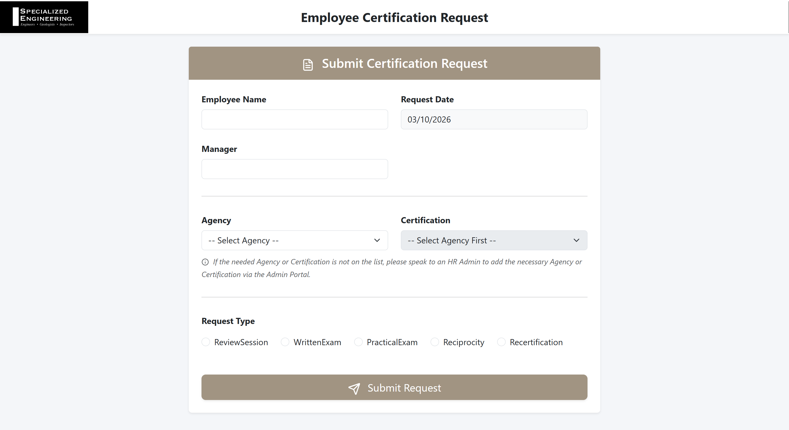
